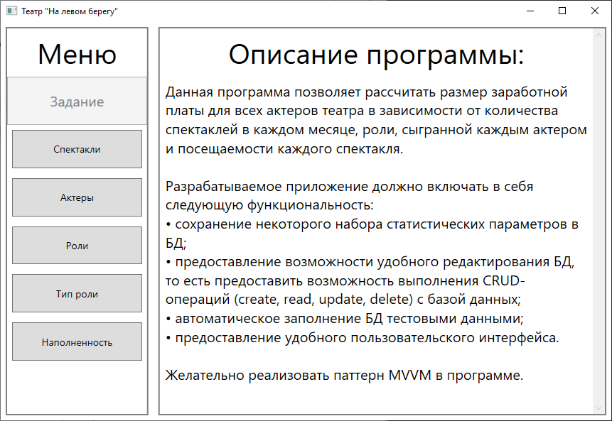
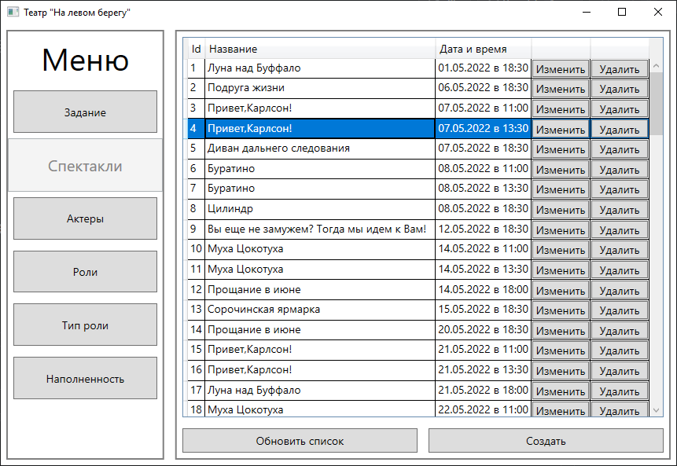
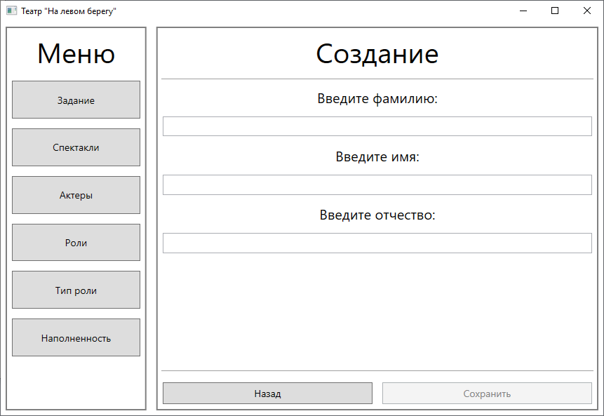
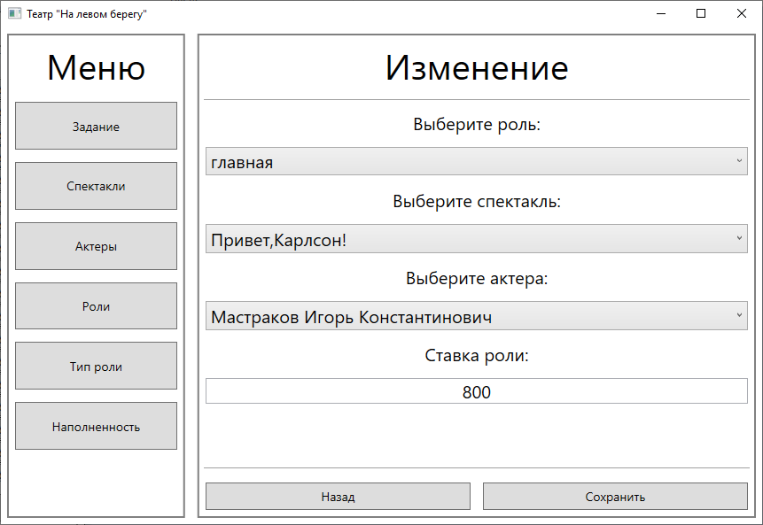

# AdminHelper

The application provides the ability to perform some operations with the database.



## Subject area
Assistance to the theater manager.

## App description
This program allows admin to calculate the wages for all actors of the theater, depending on the number of performances in each month, the role played by each actor and the fullness of each performance.

## Code description
The following technologies were used in the project:
- C# 10
- WPF
- EntityFramework Core 6 (ORM)
- MS SQL (Local DB)
- MSTest

The following approaches were used to build a scalable code structure:
- DI (Dependency Injection)[^1]
- Pattern MVVM
- Pattern Command (for MVVM)
- Pattern Repository (abstraction from ORM)
- Pattern Service Locator

## Examples

## Tables view example


## Entity creating example


## Entity editing example


[^1]: DI implemented with using ```Microsoft.Extensions.Hosting (6.0.1)```
